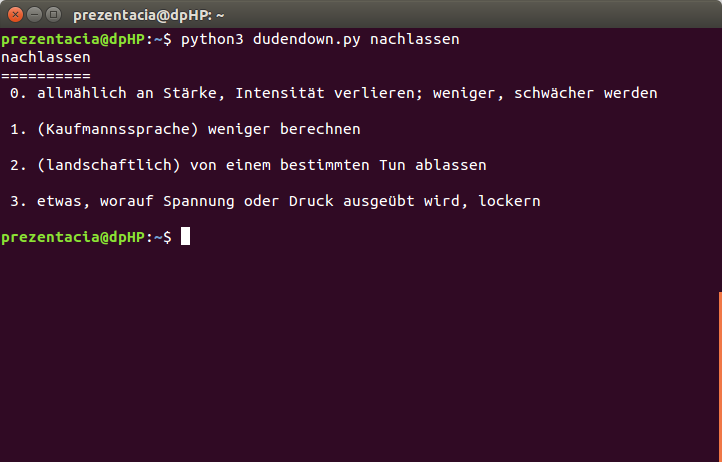

# Duden [](https://travis-ci.org/radomirbosak/duden) [](https://pypi.python.org/pypi/duden/)

**duden** is a CLI-based program and python module, which can provide various information about given german word. The provided data are parsed from german dictionary [duden.de](http://duden.de).



## Installation
```console
pip3 install duden
```

## Usage

### CLI
```console
$ duden Löffel

Löffel, der
===========
Word type: Substantiv, maskulin
Commonness: 2/5
Separation: Löf|fel
Meaning overview:
 0.  a. [metallenes] [Ess]gerät, an dessen unterem Stielende eine schalenartige Vertiefung sitzt und das zur Aufnahme von Suppe, Flüssigkeiten, zur Zubereitung von Speisen o. Ä. verwendet wird
     b. (Medizin) Kürette

 1. (Jägersprache) Ohr von Hase und Kaninchen

Synonyms:
Ohr; [Ge]hörorgan; (salopp) Horcher, Horchlappen, Lauscher; (Jägersprache) Loser, Teller
```

<details>
<summary>Full CLI syntax (expand)</summary>

```console
$ duden --help
usage: duden [-h] [--title] [--name] [--article] [--part-of-speech]
             [--frequency] [--usage] [--word-separation]
             [--meaning-overview] [--synonyms] [--origin]
             [--compounds [COMPOUNDS]] [-g [GRAMMAR]] [--export]
             [-r RESULT] [--fuzzy] [--no-cache] [-V]
             word

positional arguments:
  word

optional arguments:
  -h, --help            show this help message and exit
  --title               display word and article
  --name                display the word itself
  --article             display article
  --part-of-speech      display part of speech
  --frequency           display commonness (1 to 5)
  --usage               display context of use
  --word-separation     display proper separation (line separated)
  --meaning-overview    display meaning overview
  --synonyms            list synonyms (line separated)
  --origin              display origin
  --compounds [COMPOUNDS]
                        list common compounds
  -g [GRAMMAR], --grammar [GRAMMAR]
                        list grammar forms
  --export              export parsed word attributes in yaml format
  -r RESULT, --result RESULT
                        display n-th (starting from 1) result in case of
                        multiple words matching the input
  --fuzzy               enable fuzzy word matching
  --no-cache            do not cache retrieved words
  -V, --version         print program version
```
</details>

### Module usage

```python
>>> import duden
>>> w = duden.get('Loeffel')
>>> w.name
'Löffel'
>>> w.word_separation
['Löf', 'fel']
>>> w.synonyms
'Ohr; [Ge]hörorgan; (salopp) Horcher, Horchlappen, Lauscher; (Jägersprache) Loser, Teller'
```
For more examples see [usage documentation](docs/usage.md).

## Dependencies

Python modules:
* beautifulsoup4
* requests
* crayons
* pyxdg
* pyyaml

## Testing

```console
make test
```

## Supported versions of Python

* Python 3
